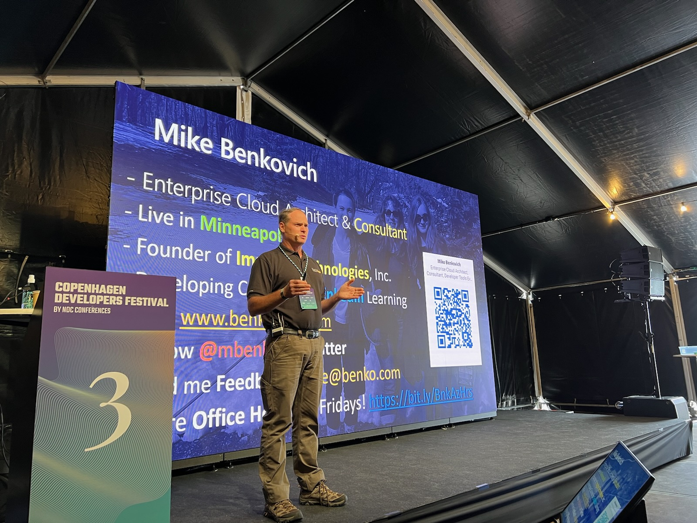
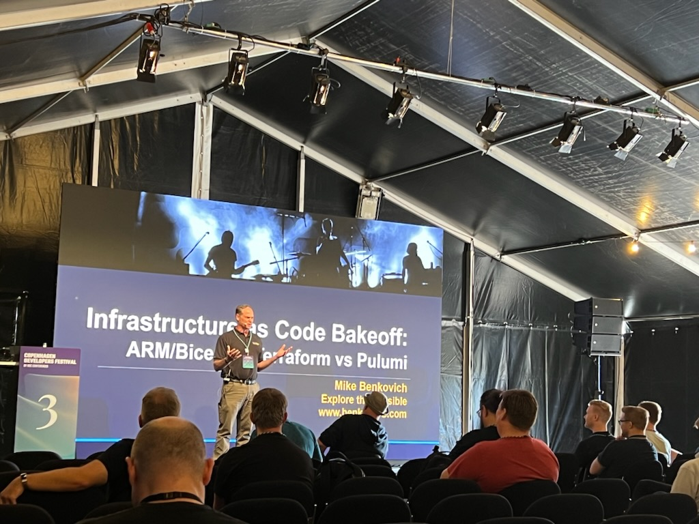
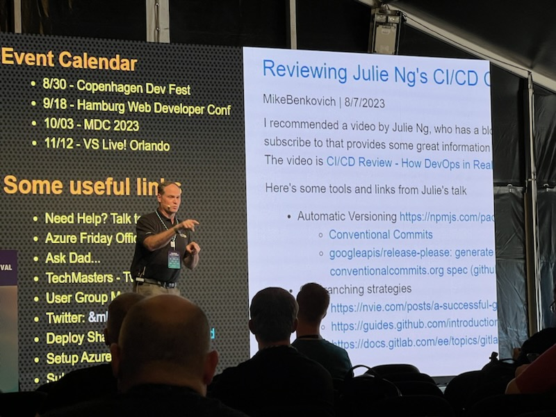
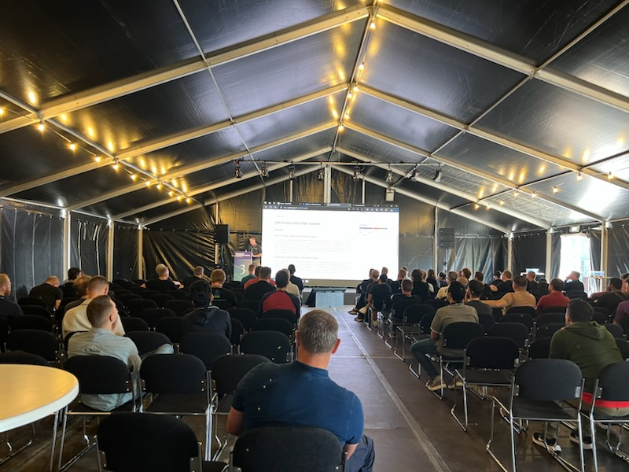
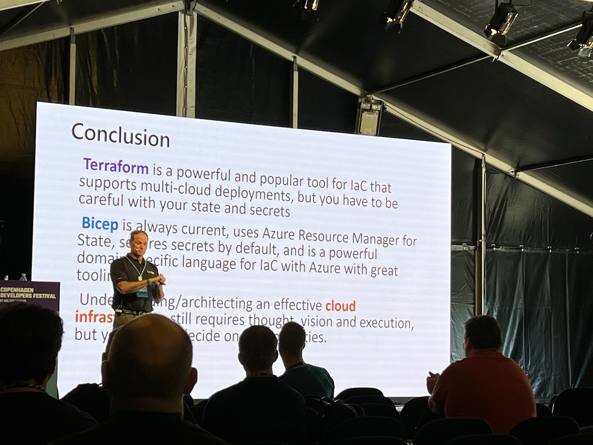

# CPH DevFest 2023 Code Samples

## Sessions

### Permit To Cloud - Land with Confidence in Azure

An application is an idea that has code, data and infrastructure, and choosing whether to build a conveyor belt or to put up guard rails along the path is important in maintaining velocity to the cloud. In this session, we explore the tools available in Azure for creating and enforcing governance policy, standards and infrastructure, including Azure resource template technologies and Bicep, Azure blueprints, as well as DevOps processes including GitHub Actions that you can use to ensure your cloud journey is predictable, secure and compliant. We’ll see how the tools work and share best practices for maturing your cloud journey.

### IaC Bake Off - ARM vs Bicep vs Terraform vs Pulumi

Infrastructure as Code comes in many flavors, and the Azure Cloud's default deployment templates work with Azure Resource Manager (ARM) to define and deploy infrastructure. Working with the JSON format of ARM can be challenging, but Microsoft has introduced a language processor called Bicep which generates ARM as output. At the same time there are other options, including scripting tools, Terraform, Pulumi, Ansible and others. In this session we'll compare creating infrastructure using ARM, Terraform and Bicep, and compare pros and cons to each.
<<<<<<< HEAD

=======
>>>>>>> 74bfc0dfd0e55c2707f8ff71c3bf1c9e9a5e0bdf

## References

### Governance Best Practices

- [Azure and GitHub](https://bit.ly/azGitHub)
- [Azure DevOps](https://bit.ly/azDevOps)
- [Best Practices](https://bit.ly/azBestPractices)
- [Cost Management](https://bit.ly/azCostMgmt)
- [Tagging](https://bit.ly/azTagging)
- [Azure Locations](https://bit.ly/azRegions)
- [Naming Standards](https://bit.ly/azNames)

### Infrastructure as Code

- [Bicep and Terraform compared · Thorsten Hans' blog (thorsten-hans.com)](https://www.thorsten-hans.com/bicep-and-terraform-compared/)
- [Design Principles and Practices for Terraform | by Fernando Villalba | The Startup | Medium](https://medium.com/swlh/design-principles-and-practices-for-terraform-276b2c463563)
- [Getting started with Azure Bicep for ARM template creation (zimmergren.net)](https://zimmergren.net/getting-started-azure-bicep/)
- [How to Create Terraform Multiple Environments (getbetterdevops.io)](https://getbetterdevops.io/terraform-create-infrastructure-in-multiple-environments/)
- [ARM Templates vs Terraform: Comparison and Fundamental Differences | Dinarys](https://dinarys.com/blog/azure-resource-manager-arm-shablony-vs-terraform)
- [ARM Templates vs Terraform vs Pulumi - Infrastructure as Code in 2021 | Julie Ng](https://julie.io/writing/arm-terraform-pulumi-infra-as-code/)
